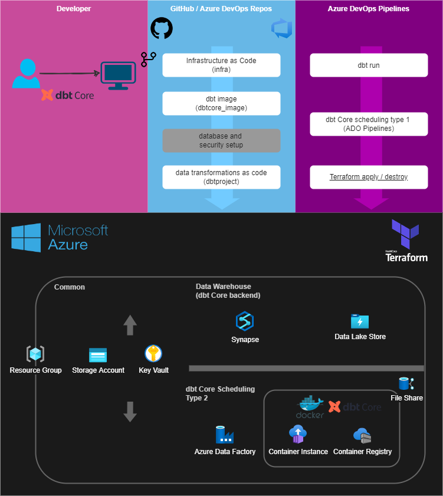

# dbt on Azure

## Overview

This project provides an end-to-end, enterprise-ready, scalable and robust implementation of dbt on Azure

The solution realized by this project is characterized by the following:

- Fully based on Microsoft Azure
- Fully automated. The solution follows the paradigm of "Everything as Code" where all code is validated and delivered automatically via CI/CD
- Uses a [monorepo](https://en.wikipedia.org/wiki/Monorepo#:~:text=In%20version%20control%20systems%2C%20a,stored%20in%20the%20same%20repository.) where infranstructure (Terraform) code and data transformation code (dbt) are elegantly defined and deployed from one repository
- dbt runs are scheduled via either Azure DevOps Pipelines (ADO) or Azure Container Instance (ACI)
- dbt database backed is Microsoft Synapse with Dedicated Pools
- Code automataion (CI/CD) is realized with Azure DevOps Pipelines (ADO Pipelines)
- All infrastructured is deployed programmatically (via Terraform)

## Use Cases

Consider this solution for:
- Using dbt as a transformation tool in medium and large organizations that are strategically alinged to Microsoft products
- Organizations with limited capacity or expertise using dbt on Azure and want to levarage existing blueprints with embeded best practices to get up and running with dbt on Azure in no time
- Organizations that value solutions that follow end-to-end DevOps practices such as version control, code review, continuous integration and continouous deployment

## Architecture

## Workflow

These are the different development workflows supported by the solution:

### Data Transformations (dbt)

1. A developer changes application source code.
2. Application code including the web.config file is committed to the source code repository in Azure Repos.
3. Continuous integration triggers application build and unit tests using Azure Test Plans.
4. Continuous deployment within Azure Pipelines triggers an automated deployment of application artifacts with environment-specific configuration values.
5. The artifacts are deployed to Azure App Service.
6. Azure Application Insights collects and analyzes health, performance, and usage data.
7. Developers monitor and manage health, performance, and usage information.
8. Backlog information is used to prioritize new features and bug fixes using Azure Boards.

### Infrastructure (Terraform)

1. A developer changes application source code.
2. Application code including the web.config file is committed to the source code repository in Azure Repos.
3. Continuous integration triggers application build and unit tests using Azure Test Plans.
4. Continuous deployment within Azure Pipelines triggers an automated deployment of application artifacts with environment-specific configuration values.
5. The artifacts are deployed to Azure App Service.
6. Azure Application Insights collects and analyzes health, performance, and usage data.
7. Developers monitor and manage health, performance, and usage information.
8. Backlog information is used to prioritize new features and bug fixes using Azure Boards.

## Key Components

- **Version Control** asdf adf
- **dbt Scheduling 1** dff ads
- **dbt Scheudling 2** asdf ad
- **Infrastructure** dfasdf

## Alternatives

### Version Control

adfasdfadfadfa

### dbt Scheduling

adadfadfadfadfad

## Considerations

### Security

- One
- Two

### Costs

- One
- Two

## Deploying this solution

### Prerequisites

### Walk-through

## Additional Enhancements

- Sending all logs to centralized logging repository such as Azure Monitor (simple)
- Dynamic extraction of Azure Key Vault values from all automation scripts

## Copyright

© 2022 Divergent Insights Pty Ltd - <info@divergentinsights.com.au>